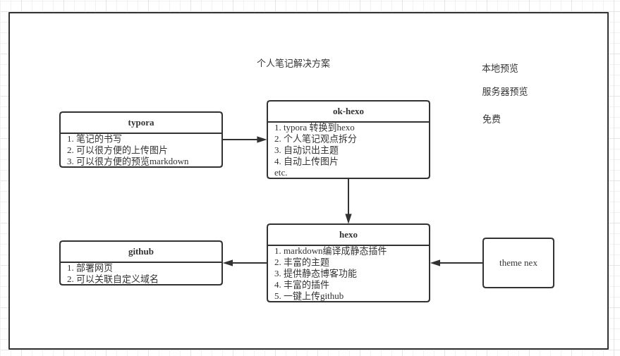

# ok-hexo

本项目主要提供一个基于`hexo`，`typort`的个人博客解决方案。目前我的[笔记](https://guoxiujun.com)在使用这套解决方案维护。

`typora`是一个非常优秀的**markdown**书写工具。`hexo`是我目前使用的静态博客，他非常的小巧而且有许多插件。`ok-hexo`的目的，则是把`typora`书写的笔记，生成对应`hexo`静态博客。

`ok-hexo`使用开发语言选用了**kotlin**,**python** 。选用`kotlin`是因为我本身是`java`开发，`jvm`平台有许多开源的组件，我可以不用，但是它不能没有。`python`的选用是因为`ok-hexo`支持笔记主题自动抽取，这部分用了一些智能算法，`python`实现和对应环境的搭建较为简单。

## 实现功能
`ok-hexo`目前已经实现功能
- typora markdown 编译到 hexo
- 根据一级标题自动拆分文章
- 文档主题自动提取

## 待实现
1. 文档主题关联
2. 增量计算
3. 安装包整理
4. hexo 主题使用教程更新

## 支持项目
- [随笔](https://guoxiujun.com)